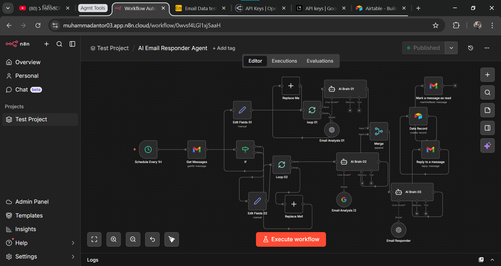

# 🤖 AI Email Responder Agent (n8n Automation)

An AI-powered email automation system built with n8n that automatically reads, analyzes, categorizes, and responds to incoming emails — without any manual work.

---

## 📌 Project Overview

This project is designed to automate the entire email handling workflow.

The system periodically checks incoming emails, extracts attachments, analyzes content using AI, categorizes emails, stores structured data, and marks processed emails automatically.

---

## ⚙️ How It Works

1. ⏰ **Scheduled Trigger**
   - The system runs automatically at a fixed interval using a Schedule node.

2. 📥 **Fetch Emails**
   - Retrieves all incoming emails from Gmail.

3. 📎 **Attachment Handling**
   - Separates email content and attachments.
   - Extracts important data from attachments.

4. 🧠 **AI Analysis**
   - Uses AI to analyze email content.
   - Understands intent and key information.

5. 🔄 **Categorization**
   - Automatically classifies emails into different categories.

6. 🗂 **Data Storage**
   - Stores structured data into Airtable for tracking and management.

7. ✅ **Auto Processing Completion**
   - Marks emails as processed/read in Gmail after completion.

---

## 🔥 Key Features

- Fully automated email processing system  
- AI-powered email analysis  
- Attachment extraction & handling  
- Smart categorization of emails  
- Airtable data storage integration  
- Gmail auto-read & response system  
- Scalable workflow for multiple emails  

---

## 🛠 Tools & Technologies

- **n8n** (Workflow Automation)
- **Gmail API**
- **AI Model (for analysis & response)**
- **Airtable** (Database)

---

## 🖼 Workflow Screenshot

---

## 📂 Project Files

[n8n woekflow file](workflow.json)

---

## 🚀 How to Use

1. Clone this repository  
2. Import `workflow.json` into n8n  
3. Connect your Gmail account  
4. Connect Airtable API  
5. Configure AI model  
6. Activate the workflow  

---

## 💡 Use Cases

- Customer support automation  
- Business email management  
- Lead processing system  
- Complaint & feedback handling  
- Internal email sorting system  

---

## 📈 Benefits

- Saves time by automating repetitive tasks  
- Reduces manual workload  
- Improves response speed  
- Organizes email data efficiently  

---

## 👨‍💻 Author

**Muhammad Antor**  
AI Automation builder | n8n Developer  

---

## ⭐ Support

If you like this project, feel free to ⭐ star the repository!
