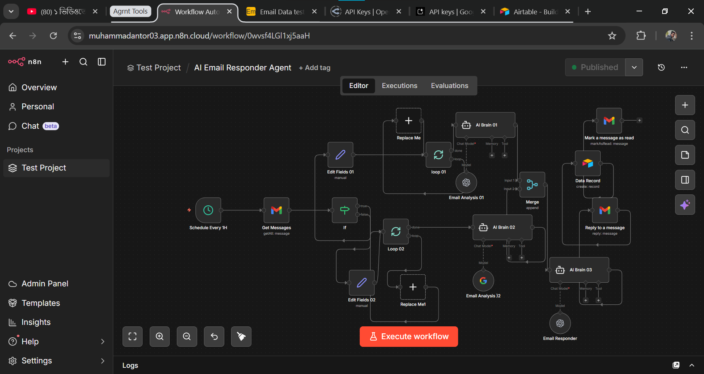

<!--
SEO Keywords: n8n email automation, AI email responder n8n, Gmail automation n8n workflow,
email categorization AI, Airtable email automation, n8n Gmail agent, AI email processing n8n,
automated email responder n8n, n8n email workflow automation, business email automation n8n,
AI email agent Bangladesh, AutomateIQ Labs, n8n workflow automation, attachment extraction n8n,
email auto-reply n8n, n8n Airtable integration, email categorization workflow
-->

<div align="center">


<br/>

[](https://n8n.io)
[](https://developers.google.com/gmail)
[](https://airtable.com)
[]()
[]()

<br/>

[](https://git.io/typing-svg)

<br/>

> **An AI-powered email automation system built with n8n that automatically reads, analyzes, categorizes, and responds to incoming emails — without any manual work.**

</div>

---

## 📌 Table of Contents

- [🔷 Project Overview](#-project-overview)
- [⚙️ How It Works](#️-how-it-works)
- [🏗 System Architecture](#-system-architecture)
- [🔥 Key Features](#-key-features)
- [🛠 Tools & Technologies](#-tools--technologies)
- [💡 Use Cases](#-use-cases)
- [📈 Benefits](#-benefits)
- [🖼 Workflow Screenshot](#-workflow-screenshot)
- [📂 Project Files](#-project-files)
- [🚀 How to Use](#-how-to-use)
- [👤 Author](#-author)

---

## 🔷 Project Overview

**AI Email Responder Agent** is a fully automated email handling system built on **n8n workflow automation**.

The system periodically checks your Gmail inbox, extracts attachments, analyzes content using AI, categorizes each email, stores structured data in Airtable, and marks processed emails — **zero human involvement required.**

```
📥 Gmail Inbox → 🤖 AI Analysis → 🔄 Categorize → 🗂 Airtable → ✅ Mark as Read
```

---

## ⚙️ How It Works

### Step-by-Step Pipeline

**1. ⏰ Scheduled Trigger**
The system runs automatically at a fixed interval using an n8n Schedule node — no manual activation needed.

**2. 📥 Fetch Emails**
Retrieves all incoming unread emails from Gmail via the Gmail API.

**3. 📎 Attachment Handling**
- Separates email body content from attachments
- Extracts and processes important data from attachments

**4. 🧠 AI Analysis**
- AI model analyzes the full email content
- Understands intent, tone, and key information
- Generates appropriate response or action

**5. 🔄 Categorization**
Automatically classifies emails into categories:
- Customer Support
- Lead / Inquiry
- Complaint / Feedback
- Internal / Administrative
- Spam / Low Priority

**6. 🗂 Data Storage**
Stores structured email data into Airtable — including sender, subject, category, summary, and timestamp.

**7. ✅ Auto Processing Completion**
Marks emails as processed/read in Gmail after the full workflow completes successfully.

---

## 🏗 System Architecture

```
┌────────────────────────────────────────────────────────────────┐
│                  AI EMAIL RESPONDER WORKFLOW                    │
│                                                                  │
│  ⏰ Schedule Trigger (fixed interval)                           │
│         │                                                        │
│         ▼                                                        │
│  📥 Gmail API — Fetch Unread Emails                             │
│         │                                                        │
│         ▼                                                        │
│  📎 Attachment Check                                            │
│    ├── Has Attachment → Extract & Process Attachment Data       │
│    └── No Attachment → Direct to AI Analysis                   │
│         │                                                        │
│         ▼                                                        │
│  🧠 AI Model — Analyze Email Content                            │
│    • Understand intent & key information                        │
│    • Generate response or action plan                           │
│         │                                                        │
│         ▼                                                        │
│  🔄 Categorize Email                                            │
│    ├── Support / Inquiry / Complaint / Lead / Internal          │
│         │                                                        │
│         ▼                                                        │
│  🗂 Airtable — Store Structured Data                            │
│    • Sender, Subject, Category, Summary, Timestamp              │
│         │                                                        │
│         ▼                                                        │
│  ✅ Gmail — Mark as Read / Processed                            │
└────────────────────────────────────────────────────────────────┘
```

---

## 🔥 Key Features

| Feature | Description |
|---|---|
| 🤖 **Fully Automated** | Runs on a schedule — zero manual triggering needed |
| 🧠 **AI-Powered Analysis** | AI reads, understands intent, and generates appropriate responses |
| 📎 **Attachment Extraction** | Automatically separates and processes email attachments |
| 🔄 **Smart Categorization** | Classifies every email into the right category automatically |
| 🗂 **Airtable Integration** | All processed email data stored in structured Airtable database |
| 📬 **Gmail Auto-Read** | Marks emails as read/processed after workflow completes |
| ⚡ **Scalable** | Handles single or multiple emails in each run efficiently |
| 🔁 **Zero Manual Work** | End-to-end automation — from inbox check to data storage |

---

## 🛠 Tools & Technologies

<div align="center">

| Layer | Technology | Purpose |
|:---:|:---:|:---:|
| ⚙️ **Workflow Engine** | n8n | Full automation orchestration |
| 📬 **Email Source** | Gmail API | Fetch & manage incoming emails |
| 🧠 **AI Analysis** | AI Model (LLM) | Email understanding & response generation |
| 🗂 **Database** | Airtable | Structured email data storage |

</div>

<br/>

<div align="center">


</div>

---

## 💡 Use Cases

| Use Case | How It Helps |
|---|---|
| 🎧 **Customer Support Automation** | Auto-categorize and respond to customer queries 24/7 |
| 💼 **Business Email Management** | Keep inbox organized with zero manual sorting |
| 📊 **Lead Processing System** | Auto-detect and log new leads from email |
| 📝 **Complaint & Feedback Handling** | Route complaints to Airtable for tracking and follow-up |
| 🏢 **Internal Email Sorting** | Classify internal communications automatically |

---

## 📈 Benefits

| Benefit | Impact |
|---|---|
| ⏱️ **Saves Time** | Eliminates repetitive email-checking and manual sorting |
| 🔻 **Reduces Workload** | AI handles the full inbox — no human needed for routine emails |
| ⚡ **Faster Response** | Emails processed and responded to within minutes |
| 📁 **Organized Data** | All email data structured and searchable in Airtable |
| 📈 **Scalable** | Handles 1 or 1000 emails with the same workflow |

---

## 🖼 Workflow Screenshot

<div align="center">

### ⚙️ n8n Workflow — Full Pipeline



> Complete n8n automation pipeline — from Gmail inbox to Airtable storage

</div>

---

## 📂 Project Files

| File | Description |
|---|---|
| `README.md` | Project documentation |
| `workflow.json` | n8n workflow export — import directly into n8n |
| `screenshot.png` | Full workflow canvas screenshot |

**[📥 Download workflow.json](workflow.json)**

---

## 🚀 How to Use

### Prerequisites
- ✅ [n8n](https://n8n.io) instance (self-hosted or cloud)
- ✅ Gmail account with API access
- ✅ Airtable account + API key
- ✅ AI model API key (OpenAI / Gemini / Groq)

### Setup Steps

```bash
# 1. Clone this repository
git clone https://github.com/muhammadantor/ai-email-responder-agent-n8n

# 2. Import workflow into n8n
# Go to: n8n → Workflows → Import → select workflow.json

# 3. Configure credentials:
#    - Gmail OAuth2
#    - Airtable API Key
#    - AI Model API Key

# 4. Set your Airtable Base ID and Table Name in the Airtable node

# 5. Activate the workflow ✅
```

---

## 👤 Author

<div align="center">


### Muhammad Antor
**AI Automation Engineer | AutomateIQ Labs ⚡**

*Building smart systems that work while you sleep*

[](https://www.linkedin.com/in/muhammad-antor)
[](https://www.facebook.com/automateiq.labs/)
[](mailto:muhammadantor71@gmail.com)
[](https://github.com/muhammadantor)

</div>

---

<div align="center">

**⭐ If this project helped you, please give it a star!**

*Built with ❤️ using n8n · Gmail API · AI Model · Airtable*


</div>

<!--
SEO Keywords: n8n email automation, AI email responder n8n, Gmail automation n8n workflow,
email categorization AI n8n, Airtable email automation workflow, n8n Gmail agent automation,
AI email processing Bangladesh, automated email responder n8n, n8n email workflow,
business email automation n8n, AI email agent AutomateIQ Labs, n8n Airtable Gmail integration,
email auto-reply n8n workflow, attachment extraction n8n, n8n ai agent email Bangladesh
-->
